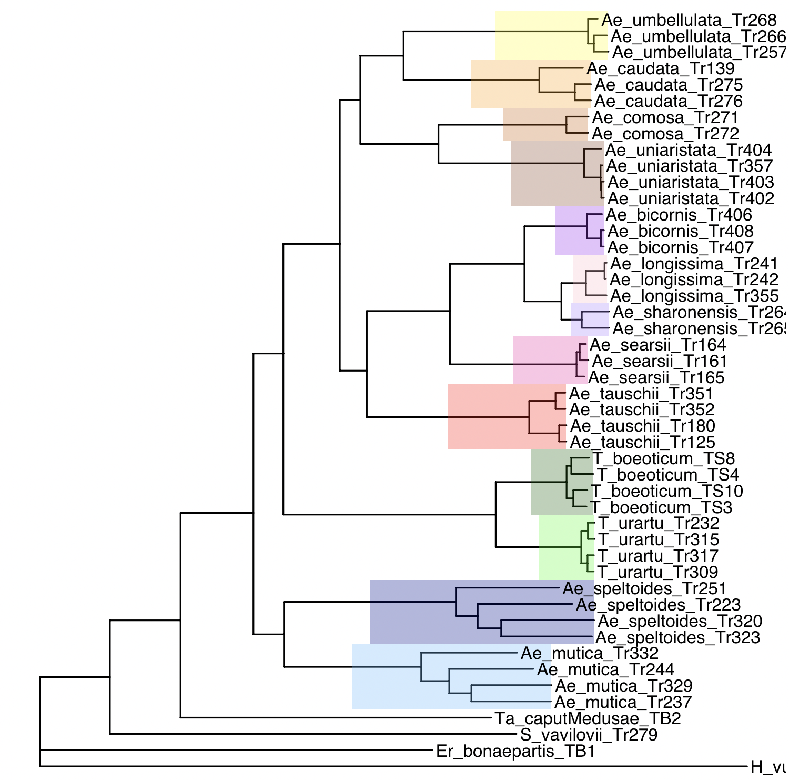
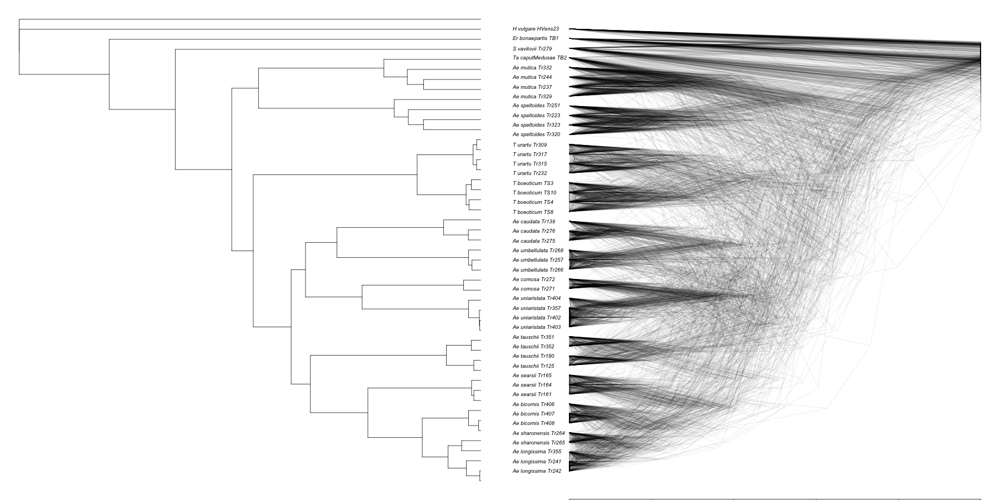

# Visualizing the species trees

We have 4 estimated species trees (in `results/RAxML`):

- full concatenation (`full-concatenation/triticeae_allindividuals_OneCopyGenes.fasta.raxml.bestTree`)
- consensus of 10Mb window concatenation trees (folder `10Mb-concatenation`)
- supertree (`07-supertree.tre`)
- wASTRAL tree (`07-individual-species-tree.tre`)

## Reproducing Figure 1A

The authors claim that Figure 1A represents both the full concatenation tree and the supertree.
Although note that we do not have the same supertree input data:
_Figure 1: (A) Phylogenetic tree of the Aegilops/Triticum genus. This same topology was obtained by both the ML analysis of 8739 gene alignments concatenation (supermatrix) and the supertree combination of 11,033 individual gene trees._

We will plot the two trees side by side.

In `results/RAxML`:
```r
library(ape)

tree1 = read.tree(file="full-concatenation/triticeae_allindividuals_OneCopyGenes.fasta.raxml.bestTree")
tree2 = read.tree(file="07-supertree.tre")

tree1 = root(tree1,outgroup="H_vulgare_HVens23", resolve.root=TRUE)
tree2 = root(tree2,outgroup="H_vulgare_HVens23", resolve.root=TRUE)

# Suppose your trees are called tree1 and tree2
# First, ladderize both trees
tree1 <- ladderize(tree1)
tree2 <- ladderize(tree2[[2]])

# Make sure they have the same tip labels
common_tips <- intersect(tree1$tip.label, tree2$tip.label)

length(common_tips)
length(tree1$tip.label)
length(tree2$tip.label)

# Reorder the second tree to match the tip order of the first
tree2 <- reorder.phylo(tree2, order = "cladewise")
tree2 <- rotateConstr(tree2, tree1$tip.label) # rotate to match tree1 tip order

# Plot side by side
par(mfrow = c(1, 2))
plot(tree1, main = "Full concatenation", cex = 0.8)
plot(tree2, main = "Supertree", cex = 0.8)
```

They don't look the same. We can calculate the RF distance:
```r
library(phangorn)
RF.dist(tree1, tree2) ## not zero!
```

Let's try to reproduce the edge colors on the full concatenation tree (`tree1`):

```r
library(ape)
library(ggtree)
library(dplyr)

species_colors <- c(
  "Ae_umbellulata" = "yellow",
  "Ae_caudata" = "orange",
  "Ae_comosa" = "darkorange3",
  "Ae_uniaristata" = "sienna4",
  "Ae_bicornis" = "purple",
  "Ae_longissima" = "pink",
  "Ae_sharonensis" = "mediumpurple1",
  "Ae_searsii" = "maroon2",
  "Ae_tauschii"    = "red",
  "T_boeoticum" = "darkgreen",
  "T_urartu" = "green",
  "Ae_speltoides" = "blue4",
  "Ae_mutica" = "steelblue1"
)

tip_species <- sapply(tree1$tip.label, function(x) {
  parts <- strsplit(x, "_")[[1]]
  paste(parts[1:2], collapse = "_")  # combine first two parts
})
tip_species <- as.factor(tip_species)


p <- ggtree(tree1)

# Loop over species to color clades
for(sp in names(species_colors)) {
  # Get tips belonging to this species
  tips <- tree1$tip.label[tip_species == sp]
  # Get MRCA node
  node <- getMRCA(tree1, tips)
  if(!is.null(node)) {
    p <- p + geom_hilight(node = node, fill = species_colors[sp], alpha = 0.3)
  }
}

# Add tip labels
p <- p + geom_tiplab()
p
```

We might want to rotate manually some clades to mimic Figure 1A:
```r
p + geom_text2(aes(subset = !isTip, label = node), hjust = -0.3)
```

We want to rotate the following clades:
```r
p <- ggtree(tree1)

p2 <- rotate(p, node = 55)
p2 <- rotate(p2, node = 62)
p2 <- rotate(p2, node = 50)
p2 <- rotate(p2, node = 49)
p2 <- rotate(p2, node = 69)
p2 <- rotate(p2, node = 83)
p2 <- rotate(p2, node = 88)
p2 <- rotate(p2, node = 71)
p2 <- rotate(p2, node = 74)


for(sp in names(species_colors)) {
  tips <- tree1$tip.label[tip_species == sp]
  node <- getMRCA(tree1, tips)  # this works on phylo object
  if(!is.null(node)) {
    p2 <- p2 + geom_hilight(node = node, fill = species_colors[sp], alpha = 0.3)
  }
}

p2 <- p2 + geom_tiplab()
p2
```

<div style="text-align:center"></div>


## Reproducing Figure 1B

This is almost the same code as in [Species tree via concatenation: 10Mb sliding window](https://solislemuslab.github.io/phylo-practicum/glemin-wheat/code/06-species-tree-supermatrix-10mb.html).

We need to be in the `results/RAxML/10Mb-concatenation` folder:

```r
library(ape)
library(phangorn)
library(phytools)
library(ggplot2)

tree_files <-list.files(pattern="\\.raxml.bestTree$") #List all .bestTree files. $ ensures the end of the name

trees<- list() # list with all the trees
class(trees)<- "multiPhylo" #make it a multiphylo object for ease of use with other 

i<-1
for(tree_file in tree_files){ ##go thru each file and read the tree
  trees[[i]]<- read.tree(tree_file)
  i<-i+1
}
```

We need to root all trees in "H_vulgare_HVens23" to reproduce [Figure 1(B)](https://www.science.org/doi/10.1126/sciadv.aav9188):

```r
#re-reroot all our gene trees by the respective outgroup
for(i in 1:length(trees)){
  trees[[i]]<- root(trees[[i]],
                         outgroup = "H_vulgare_HVens23",
                         resolve.root=TRUE)
  trees[[i]]<-chronos(trees[[i]]) ## make ultrametric for nicer densitree
}
```

We will create a consensus parsimony supertree:

```r
st<-superTree(trees)
st<-root(st,"H_vulgare_HVens23",resolve.root = T)
```

Finally, we plot the same density tree as Figure 1B:

```r
tree1ultra = chronos(tree1)

png(filename="../../../figures/figure1b.png", width = 1800, height = 900, units = "px")
par(mfrow=c(1,2), mar = c(0.1, 0.1, 0.1, 0.1))
plot(tree1ultra, show.tip.label = FALSE)
densiTree(trees,consensus=tree1, direction='leftwards', scaleX=T,type='cladogram', alpha=0.1)
dev.off()
```

<div style="text-align:center"></div>