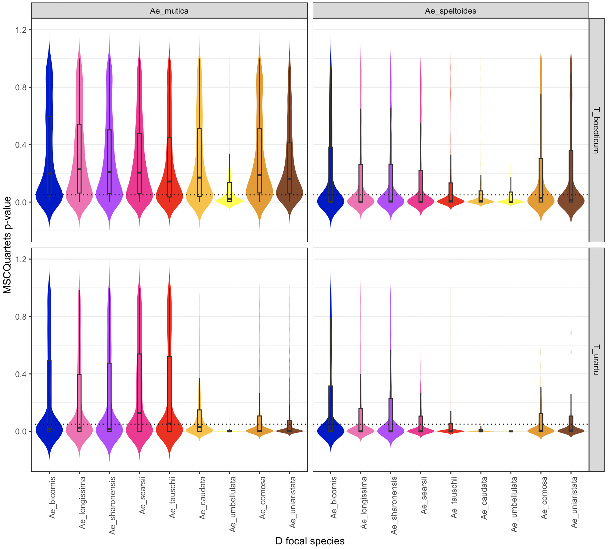

# Hybrid detection with MSCQuartets

To compare the hybrid detection results from HyDe, we will run MSCQuartets in R.

In `results`:
```r
library(MSCquartets)

gtrees=read.tree(file="09-all_gene_trees_snaq.tre")
tnames <- unique(unlist(lapply(gtrees, function(x) x$tip.label)))

QT=quartetTable(gtrees,tnames)
RQT=quartetTableResolved(QT)

pTable3=quartetTreeTestInd(RQT,"T3")
quartetTablePrint(pTable3[1:6,])

write.csv(pTable3, "11-mscquartets-ptable.csv")
```

# Reproducing Figure 3A and 3B

In `results`, we have the HyDe output files per position in chromosome 3. We want to extract the triplets were _Ae mutica, Ae speltoides, T boeoticum, T urartu_ are parents and the hybrid belongs to D clade (_Ae bicornis, Ae longissima, Ae sharonensis, Ae searsii, Ae tauschii, Ae caudata, Ae umbellilata, Ae comosa, Ae uniaristata_). 

We note something wrong in the HyDe output files.

In `results/HyDe/10Mb-concatenation-ch3`:
```r
i = 1
dt = read.table(paste0("Size_10_Mb_Chrom_3_Pos_",i,"-out.txt"), header=TRUE)
```

```r
> head(dt)
           P1        Hybrid            P2   Zscore Pvalue Gamma      AAAA AAAB
1 Ae_bicornis    Ae_caudata     Ae_comosa 13.41641      0   NaN 204375852    0
2 Ae_bicornis     Ae_comosa    Ae_caudata 13.41641      0   NaN 204375852    0
3  Ae_caudata   Ae_bicornis     Ae_comosa 13.41641      0   NaN 204375852    0
4 Ae_bicornis    Ae_caudata Ae_longissima 16.43168      0   NaN 306563778    0
5 Ae_bicornis Ae_longissima    Ae_caudata 16.43168      0   NaN 306563778    0
6  Ae_caudata   Ae_bicornis Ae_longissima 16.43168      0   NaN 306563778    0
  AABA AABB AABC ABAA ABAB ABAC ABBA BAAA ABBC CABC BACA BCAA ABCD
1    0    0    0    0    0    0    0    0    0    0    0    0    0
2    0    0    0    0    0    0    0    0    0    0    0    0    0
3    0    0    0    0    0    0    0    0    0    0    0    0    0
4    0    0    0    0    0    0    0    0    0    0    0    0    0
5    0    0    0    0    0    0    0    0    0    0    0    0    0
6    0    0    0    0    0    0    0    0    0    0    0    0    0
```

All gammas as NaN and the column AAAA has all the counts. We see the same pattern in the other positions in chromosome 3 and even the output of HyDe with the full concatenation. Therefore, we cannot reproduce Figure 3 A,B as in the paper.

We will then try to summarize MSCQuartets instead.

```r
df = read.csv("11-mscquartets-ptable.csv", header=TRUE)
```

To reproduce something similar to Figure 3A (top left panel), we want to extract the rows where there is a 1 in one of the Ae mutica columns (and zero in the other Ae muticas), 1 in one of the T boeoticum columns (and 0 in the others), and 1 in one of the Ae bicornis columns (and 0 in the others).

```r
library(dplyr)

# find the columns for each species
p1_cols   <- grep("^Ae_mutica", names(df), value = TRUE)
p2_cols     <- grep("^T_boeoticum", names(df), value = TRUE)
bicornis_cols <- grep("^Ae_bicornis", names(df), value = TRUE)


# filter rows that have exactly one "1" in each group
df_filtered <- df %>%
  filter(
    rowSums(select(., all_of(p1_cols))   == 1, na.rm = TRUE) == 1,
    rowSums(select(., all_of(p2_cols))     == 1, na.rm = TRUE) == 1,
    rowSums(select(., all_of(bicornis_cols)) == 1, na.rm = TRUE) == 1
  )

> sum(df_filtered$p_T3<0.05)/length(df_filtered$p_T3)
[1] 0.270202
```

Let's create a data frame with the pvalues:

```r
outdf = data.frame(p1 = "Ae_mutica", p2 = "T_boeoticum", hybrid = "Ae_bicornis", pval = df_filtered$p_T3)
```

Now, let's loop over the hybrid species:

```r
hybrids = c("Ae_longissima", "Ae_sharonensis", "Ae_searsii", "Ae_tauschii", "Ae_caudata", "Ae_umbellulata", "Ae_comosa", "Ae_uniaristata")

for(h in hybrids){
    hyb_cols <- grep(h, names(df), value = TRUE)
    tmp <- df %>%
    filter(
    rowSums(select(., all_of(p1_cols))   == 1, na.rm = TRUE) == 1,
    rowSums(select(., all_of(p2_cols))     == 1, na.rm = TRUE) == 1,
    rowSums(select(., all_of(hyb_cols)) == 1, na.rm = TRUE) == 1
    )
    tmpdf = data.frame(p1 = "Ae_mutica", p2 = "T_boeoticum", hybrid=h, pval=tmp$p_T3)
    outdf = rbind(outdf,tmpdf)
}

Up until now, we have the code to reproduce the top right panel of Figure 3A, but if we want to do the whole Figure, we need to change the parents too.

```r
parents1 = c("Ae_mutica", "Ae_speltoides")
parents2 = c("T_boeoticum", "T_urartu")
hybrids = c("Ae_bicornis", "Ae_longissima", "Ae_sharonensis", "Ae_searsii", "Ae_tauschii", "Ae_caudata", "Ae_umbellulata", "Ae_comosa", "Ae_uniaristata")

for(pp1 in parents1){
    for(pp2 in parents2){
        if(pp1 == "Ae_mutica" && pp2 == "T_boeoticum") next

        p1_cols   <- grep(pp1, names(df), value = TRUE)
        p2_cols     <- grep(pp2, names(df), value = TRUE)
        for(h in hybrids){
            hyb_cols <- grep(h, names(df), value = TRUE)
            tmp <- df %>%
                filter(
                rowSums(select(., all_of(p1_cols))   == 1, na.rm = TRUE) == 1,
                rowSums(select(., all_of(p2_cols))     == 1, na.rm = TRUE) == 1,
                rowSums(select(., all_of(hyb_cols)) == 1, na.rm = TRUE) == 1
                )
            tmpdf = data.frame(p1 = pp1, p2 = pp2, hybrid=h, pval=tmp$p_T3)
            outdf = rbind(outdf,tmpdf)
        }
    }
}

```

Now, we can do a violin plot of the pvalues:

```r
library(ggplot2)

## Setting the hybrid order (x axis):
hybrid_order <- c(
  "Ae_bicornis", "Ae_longissima", "Ae_sharonensis",
  "Ae_searsii", "Ae_tauschii", "Ae_caudata",
  "Ae_umbellulata", "Ae_comosa", "Ae_uniaristata"
)

outdf$hybrid <- factor(outdf$hybrid, levels = hybrid_order)

hybrid_colors <- c(
  "Ae_bicornis"     = "blue3",
  "Ae_longissima"  = "hotpink",
  "Ae_sharonensis" = "darkorchid1",
  "Ae_searsii"     = "deeppink",
  "Ae_tauschii"    = "red",
  "Ae_caudata"     = "goldenrod1",
  "Ae_umbellulata" = "yellow",
  "Ae_comosa"      = "orange2",
  "Ae_uniaristata" = "sienna4"
)


ggplot(outdf, aes(x = hybrid, y = pval, fill = hybrid)) +
  geom_violin(
    trim = FALSE,
    scale = "width",
    color = NA
  ) +
  geom_boxplot(
    width = 0.12,
    outlier.shape = NA,
    alpha = 0.85
  ) +
  facet_grid(
    rows = vars(p2),
    cols = vars(p1)
  ) +
  scale_fill_manual(values = hybrid_colors, drop = FALSE) +
  scale_x_discrete(drop = FALSE) +
  geom_hline(
    yintercept = 0.05,
    linetype = "dotted",
    color = "black"
  ) +
  labs(
    x = "D focal species",
    y = "MSCQuartets p-value"
  ) +
  theme_bw() +
  theme(
    axis.text.x = element_text(angle = 90, hjust = 1),
    panel.grid.major.x = element_blank(),
    legend.position = "none"
  )
```

<div style="text-align:center"></div>