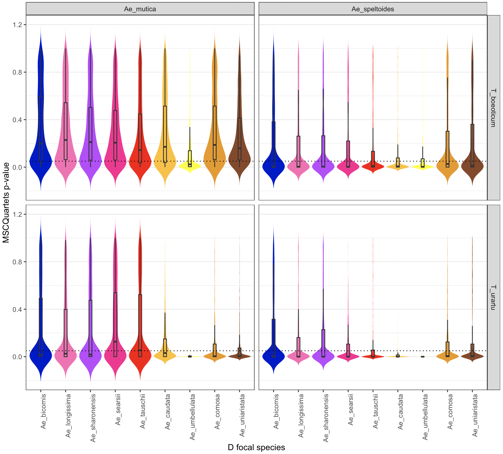

# Reproducing Figure 3A and 3B

In `results`, we have the HyDe output files per position in chromosome 3. We want to extract the triplets were _Ae mutica, Ae speltoides, T boeoticum, T urartu_ are parents and the hybrid belongs to D clade (_Ae bicornis, Ae longissima, Ae sharonensis, Ae searsii, Ae tauschii, Ae caudata, Ae umbellilata, Ae comosa, Ae uniaristata_). 


In `results/HyDe/10Mb-concatenation-ch3`:
```r
library(dplyr)
library(purrr)
library(ggplot2)

parents1 = c("Ae_mutica", "Ae_speltoides")## B Clade
parents2 = c("T_boeoticum", "T_urartu") #A Clade
hybrids = c("Ae_bicornis", "Ae_longissima", "Ae_sharonensis", "Ae_searsii", "Ae_tauschii", "Ae_caudata", "Ae_umbellulata", "Ae_comosa", "Ae_uniaristata") # D clade


hyde_chrom_dir <-"../results/HyDe/10Mb-concatenation-ch3/"
chrom_files<-list.files(hyde_chrom_dir,pattern='out.txt')

all_hyde <-list()
for(chrom_file in chrom_files){ # go thru all positions on Chromosome 3
  hyde_file<-paste(hyde_chrom_dir,chrom_file,sep='')
  hyde_result <-read.table(hyde_file,header = T)

  chrom_pos <- sub(".*_(\\d+)-out\\.txt", "\\1", chrom_file)
  
  filtered_results <- hyde_result %>%
    filter(Hybrid %in% hybrids) %>% #get the rows with hybrid species as the hybrid
    filter( #specify the parents
      (P1 %in% parents1 & P2 %in% parents2) | 
        (P1 %in% parents2 & P2 %in% parents1)
    )  %>%
    mutate(P1_signal = ABBA,
           P2_signal = AABB,
           P12_signal= ABAB)
    if(nrow(filtered_results)==0){
      next
    }
  
  all_hyde[[chrom_pos]]<-filtered_results
}
all_hyde <- bind_rows(all_hyde,.id='pos') #combine results into a single data frame
```

For Figure 3B, we only want the Ae. Mutica Species from the B clade. This way we can check the hybrid index of D species that come from Ae. Mutica.

```r
mutica <- all_hyde %>% 
  filter((P1 %in% "Ae_mutica") | (P2 %in% "Ae_mutica"))  %>%
  mutate(B_signal = ifelse(P1 %in% parents1, P1_signal , P2_signal), #Signal for the topology (B,D),A
         A_signal = ifelse(P1 %in% parents2, P1_signal , P2_signal), #Signal for the topology (A,D),B
         AB_signal= P12_signal, #Signal for the topology (A,B),D
         h_index = (A_signal-AB_signal)/(A_signal+B_signal-(2*AB_signal)) # produces values outside [0,1]
         ) %>%
  mutate(Gamma = ifelse((Gamma<0.0) | (Gamma>1.0),NA,Gamma)) %>%
  mutate(h_index = ifelse((h_index<0.0) | (h_index>1.0),NA,h_index)) 


ggplot(mutica, aes(x = as.numeric(pos), y = Gamma, color)) +
  stat_summary(fun.data = "mean_cl_normal", #confidence interval
               geom = "errorbar", 
               width = 0.2, 
               color = "royalblue") +
  
  stat_summary(fun = "mean",  #mean dots
               geom = "point", 
               size = 2, 
               color = "black") +
  
  # Add the horizontal dashed line at 0.5
  geom_hline(yintercept = 0.5, linetype = "dashed", color = "red") +
  
  # Set Y-axis limits to represent probability
  scale_y_continuous(limits = c(0, 1), breaks = seq(0, 1, 0.2)) +
  scale_x_continuous(limits = c(0, 60), breaks = seq(0, 60, 10)) +
  theme_bw() +
  labs(
    x = "Genomic Position (Window Index)", 
    y = expression(gamma),
    title = "Inheritance Probability across Chromosome 3"
  ) 

```

To recreate the figure in 3A (top left panel) we want entries with Ae. mutica and T. Boeoticum 

```r
#filter entries with the focal species.
A_B_species<- c("Ae_mutica","T_boeoticum")
mutica_boeoticum <- mutica %>% 
  filter((P1 %in% A_B_species) & (P2 %in% A_B_species) )
  
##Make the order of species match Fig3A
target_order <- c(
  "Ae_bicornis", "Ae_longissima", "Ae_sharonensis", "Ae_searsii", 
  "Ae_tauschii", "Ae_caudata", "Ae_umbellulata", "Ae_comosa", "Ae_uniaristata"
)
mutica_boeoticum <- mutica_boeoticum %>%
  mutate(Hybrid = factor(Hybrid, levels = target_order))


ggplot(mutica_boeoticum, aes(x = Hybrid, y = Gamma, fill = Hybrid)) +
  geom_violin(
    trim = TRUE,
    scale = "width",
    color = NA
  ) +
  geom_boxplot(
    width = 0.12,
    outlier.shape = NA,
    alpha = 0.85
  ) +
  scale_fill_manual(values = hybrid_colors, drop = FALSE) +
  scale_x_discrete(drop = FALSE) +
  geom_hline(
    yintercept = 0.5,
    linetype = "dotted",
    color = "black"
  ) +
  labs(
    x = "D focal species",
    y = expression(gamma)
  ) +
  theme_bw() +
  theme(
    axis.text.x = element_text(angle = 90, hjust = 1),
    panel.grid.major.x = element_blank(),
    legend.position = "none"
  )
```

It is worth noting that in figure 3A the authors only use entries with of p-value less than $$10^-6$$. We can first filter our results before plotting:

```r
significant_mutica_boeoticum <- mutica_boeoticum %>%
	filter(Pvalue<1e-6)

########################
##Plot as we did above##
########################

```

Note that this may not make a very complete figure as we are only using the HyDe results from Chromosome 3 instead of the whole genome.

To make other panels, we need only select other focal species before filtering and plotting our data.
For example, to plot the top right panel, we would use specify the focal species:

```r
A_B_species<- c("Ae_speltoides","T_boeoticum")
```

# Hybrid detection with MSCQuartets

To compare the hybrid detection results from HyDe, we will run MSCQuartets in R.

In `results`:
```r
library(MSCquartets)

gtrees=read.tree(file="09-all_gene_trees_snaq.tre")
tnames <- unique(unlist(lapply(gtrees, function(x) x$tip.label)))

QT=quartetTable(gtrees,tnames)
RQT=quartetTableResolved(QT)

pTable3=quartetTreeTestInd(RQT,"T3")
quartetTablePrint(pTable3[1:6,])

write.csv(pTable3, "11-mscquartets-ptable.csv")
```

To produce something similar to Figure 3A (top left panel), 


```r
df = read.csv("11-mscquartets-ptable.csv", header=TRUE)
```

To reproduce something similar to Figure 3A (top left panel), we want to extract the rows where there is a 1 in one of the Ae mutica columns (and zero in the other Ae muticas), 1 in one of the T boeoticum columns (and 0 in the others), and 1 in one of the Ae bicornis columns (and 0 in the others).

```r
library(dplyr)

# find the columns for each species
p1_cols   <- grep("^Ae_mutica", names(df), value = TRUE)
p2_cols     <- grep("^T_boeoticum", names(df), value = TRUE)
bicornis_cols <- grep("^Ae_bicornis", names(df), value = TRUE)


# filter rows that have exactly one "1" in each group
df_filtered <- df %>%
  filter(
    rowSums(select(., all_of(p1_cols))   == 1, na.rm = TRUE) == 1,
    rowSums(select(., all_of(p2_cols))     == 1, na.rm = TRUE) == 1,
    rowSums(select(., all_of(bicornis_cols)) == 1, na.rm = TRUE) == 1
  )

> sum(df_filtered$p_T3<0.05)/length(df_filtered$p_T3)
[1] 0.270202
```

Let's create a data frame with the pvalues:

```r
outdf = data.frame(p1 = "Ae_mutica", p2 = "T_boeoticum", hybrid = "Ae_bicornis", pval = df_filtered$p_T3)
```

Now, let's loop over the hybrid species:

```r
hybrids = c("Ae_longissima", "Ae_sharonensis", "Ae_searsii", "Ae_tauschii", "Ae_caudata", "Ae_umbellulata", "Ae_comosa", "Ae_uniaristata")

for(h in hybrids){
    hyb_cols <- grep(h, names(df), value = TRUE)
    tmp <- df %>%
    filter(
    rowSums(select(., all_of(p1_cols))   == 1, na.rm = TRUE) == 1,
    rowSums(select(., all_of(p2_cols))     == 1, na.rm = TRUE) == 1,
    rowSums(select(., all_of(hyb_cols)) == 1, na.rm = TRUE) == 1
    )
    tmpdf = data.frame(p1 = "Ae_mutica", p2 = "T_boeoticum", hybrid=h, pval=tmp$p_T3)
    outdf = rbind(outdf,tmpdf)
}

Up until now, we have the code to reproduce the top right panel of Figure 3A, but if we want to do the whole Figure, we need to change the parents too.

```r
parents1 = c("Ae_mutica", "Ae_speltoides")
parents2 = c("T_boeoticum", "T_urartu")
hybrids = c("Ae_bicornis", "Ae_longissima", "Ae_sharonensis", "Ae_searsii", "Ae_tauschii", "Ae_caudata", "Ae_umbellulata", "Ae_comosa", "Ae_uniaristata")

for(pp1 in parents1){
    for(pp2 in parents2){
        if(pp1 == "Ae_mutica" && pp2 == "T_boeoticum") next

        p1_cols   <- grep(pp1, names(df), value = TRUE)
        p2_cols     <- grep(pp2, names(df), value = TRUE)
        for(h in hybrids){
            hyb_cols <- grep(h, names(df), value = TRUE)
            tmp <- df %>%
                filter(
                rowSums(select(., all_of(p1_cols))   == 1, na.rm = TRUE) == 1,
                rowSums(select(., all_of(p2_cols))     == 1, na.rm = TRUE) == 1,
                rowSums(select(., all_of(hyb_cols)) == 1, na.rm = TRUE) == 1
                )
            tmpdf = data.frame(p1 = pp1, p2 = pp2, hybrid=h, pval=tmp$p_T3)
            outdf = rbind(outdf,tmpdf)
        }
    }
}

```

Now, we can do a violin plot of the pvalues:

```r
library(ggplot2)

## Setting the hybrid order (x axis):
hybrid_order <- c(
  "Ae_bicornis", "Ae_longissima", "Ae_sharonensis",
  "Ae_searsii", "Ae_tauschii", "Ae_caudata",
  "Ae_umbellulata", "Ae_comosa", "Ae_uniaristata"
)

outdf$hybrid <- factor(outdf$hybrid, levels = hybrid_order)

hybrid_colors <- c(
  "Ae_bicornis"     = "blue3",
  "Ae_longissima"  = "hotpink",
  "Ae_sharonensis" = "darkorchid1",
  "Ae_searsii"     = "deeppink",
  "Ae_tauschii"    = "red",
  "Ae_caudata"     = "goldenrod1",
  "Ae_umbellulata" = "yellow",
  "Ae_comosa"      = "orange2",
  "Ae_uniaristata" = "sienna4"
)


ggplot(outdf, aes(x = hybrid, y = pval, fill = hybrid)) +
  geom_violin(
    trim = FALSE,
    scale = "width",
    color = NA
  ) +
  geom_boxplot(
    width = 0.12,
    outlier.shape = NA,
    alpha = 0.85
  ) +
  facet_grid(
    rows = vars(p2),
    cols = vars(p1)
  ) +
  scale_fill_manual(values = hybrid_colors, drop = FALSE) +
  scale_x_discrete(drop = FALSE) +
  geom_hline(
    yintercept = 0.05,
    linetype = "dotted",
    color = "black"
  ) +
  labs(
    x = "D focal species",
    y = "MSCQuartets p-value"
  ) +
  theme_bw() +
  theme(
    axis.text.x = element_text(angle = 90, hjust = 1),
    panel.grid.major.x = element_blank(),
    legend.position = "none"
  )
```

<div style="text-align:center"></div>